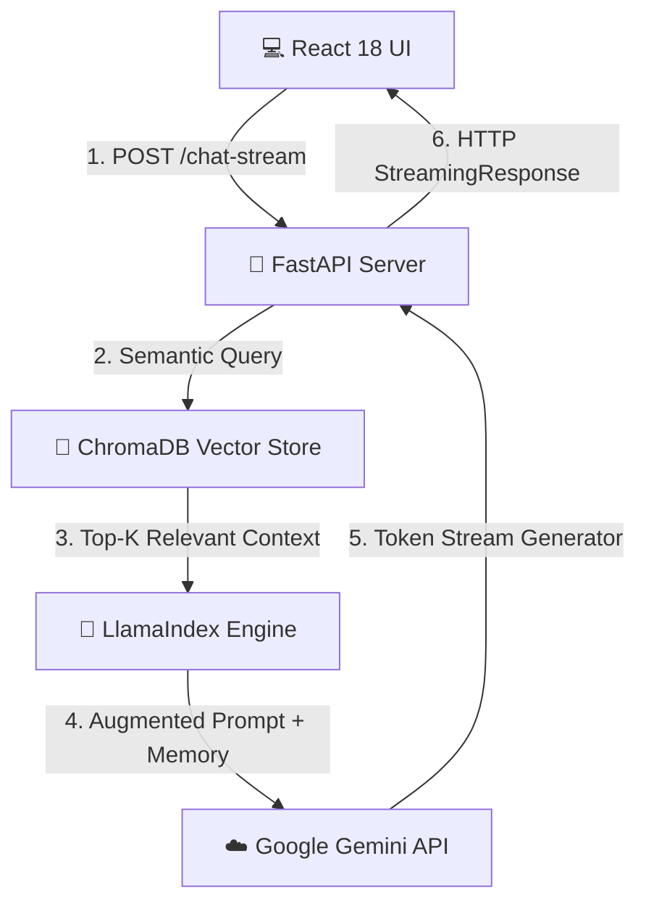

# 🛡️ VulnCopilot-RAG: DevSecOps AI Intelligence Engine


**VulnCopilot-RAG** adalah sistem AI DevSecOps berarsitektur **Retrieval-Augmented Generation (RAG)** yang memberikan analisis kerentanan kode, rekomendasi remediasi, dan penelusuran standar OWASP Top 10 secara *real-time* berbasis Knowledge Base privat.

---

## ⚡ Key Highlights

- **🧠 Domain-Specific RAG Engine:** Dipersonalisasi dengan *System Prompt* spesialis DevSecOps & Knowledge Base keamanan OWASP.
- **⚡ Ultra-Low Latency Streaming (< 0.5s TTFT):** Mengalirkan token balasan kata demi kata (*Server-Sent Streaming*) menggunakan `StreamingResponse` FastAPI & `ReadableStream` React.
- **💾 Contextual Vector Indexing:** Powered by **ChromaDB** vector store & **Google Gemini Embeddings** (`gemini-embedding-2-preview`).
- **🛡️ Anti-Hallucination Guardrails:** Mengunci batasan AI hanya pada Knowledge Base referensi yang terverifikasi.
- **💬 Conversational Memory:** Memiliki buffer konteks memori percakapan bertahap (`ChatMemoryBuffer`).
- **🎨 Modern Dark Dashboard:** Integrated React 18 + Vite UI dengan Markdown rendering & syntax highlighting.

---

## 🏗️ System Architecture



---

## 🧰 Tech Stack

| Layer | Technology | Function |
| :--- | :--- | :--- |
| **Frontend** | React 18, Vite, Lucide Icons, ReactMarkdown | User Interface & Real-time Stream Consumer |
| **Backend API** | FastAPI, Uvicorn, Pydantic | Async REST & Streaming Endpoints |
| **RAG Orchestration** | LlamaIndex Core, MarkdownNodeParser | Data Chunking, Retrieval & Augmentation |
| **Vector Store** | ChromaDB (Persistent Storage) | High-dimensional Semantic Vector Search |
| **AI / LLM** | Google Gemini Flash & Embedding-2 | Text Generation & Embedding Model |

---

## 🚀 Quick Start

### 1. Prerequisites
- **Python 3.10+**
- **Node.js 18+**
- **Google Gemini API Key** (`GOOGLE_API_KEY` di file `.env`)

### 2. Environment Setup
Buat file `.env` di root project:
```env
GOOGLE_API_KEY=your_gemini_api_key_here
```

### 3. Backend Execution (FastAPI)
```bash
# Aktifkan virtual environment
.\venv\Scripts\Activate

# Install dependensi
pip install -r requirements.txt

# Jalankan server
uvicorn app:app --reload
```
> Backend API berjalan di `http://localhost:8000` (Swagger docs di `http://localhost:8000/docs`).

### 4. Frontend Execution (React)
```bash
cd frontend
npm install
npm run dev
```
> Web Dashboard berjalan di `http://localhost:5173`.

---

## 📡 API Reference

| Endpoint | Method | Description |
| :--- | :--- | :--- |
| `/` | `GET` | Service Health & Version Check |
| `/chat-stream` | `POST` | Real-time Streaming Chat Response (`text/plain`) |
| `/chat` | `POST` | Synchronous Single Chat Response |
| `/reset-session` | `POST` | Reset Conversational Memory Buffer |

---

## 📁 Repository Structure

```text
RAG_Project_1/
├── app.py              # FastAPI Application & Streaming Endpoints
├── rag_engine.py       # Core RAG Pipeline (LlamaIndex + ChromaDB + Gemini)
├── requirements.txt    # Python Backend Dependencies
├── data/               # Document Knowledge Base (OWASP Standards)
├── chroma_db/          # Persistent Vector Database Store
└── frontend/           # React 18 Frontend Application
    ├── src/
    │   ├── App.jsx     # Main Dashboard & Streaming Logic
    │   ├── App.css     # DevSecOps Theme Design Tokens
    │   └── main.jsx    # React Entry Point
    └── vite.config.js
```

---

## 📜 License

Distributed under the **MIT License**. Dibuat untuk tujuan edukasi, riset, dan portofolio profesional DevSecOps RAG AI.
